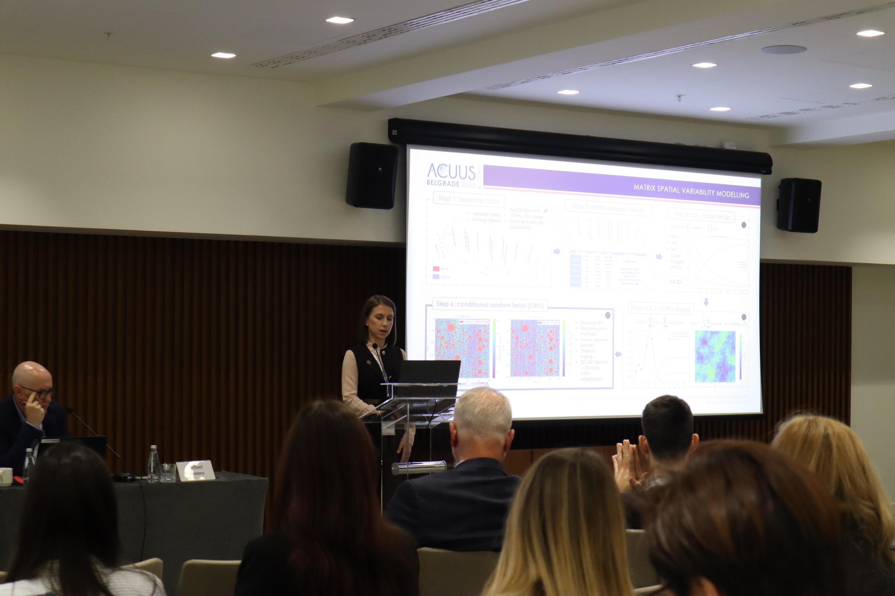

At the world conference “19th World Conference of the Associated Research Centres for the Urban Underground Space,” held from 4 to 7 November 2025 at the Sava Center in Belgrade, the DiNum team presented the paper “Towards an Advanced Geotechnical Modelling of Block-in-Matrix Rock for Robust Tunnel Design and Construction,” in collaboration with the University of Ljubljana. The importance and relevance of the idea that DiNum-GEO promotes, develops, and advances is also reflected in the theme of the conference itself – “Underground mobility and elevated thinking: new opportunities and challenges in the use of urban space” – as well as in all the scientific contributions presented during four extremely productive and inspiring days at the Sava Center. During this conference, the DiNum team had a unique opportunity to meet and exchange ideas and experiences with world experts in the fields of tunnel construction and spatial planning. 
More about the publication at the link: ***************************************************. 

  

    
    
  

  <button onclick="dinumgeoCarouselMove(-1)"
    style="position: absolute; left: 8px; top: 50%; transform: translateY(-50%); background: rgba(0,0,0,0.4); color: white; border: none; width: 40px; height: 40px; border-radius: 50%; cursor: pointer; font-size: 20px;">
    ‹
  </button>

  <button onclick="dinumgeoCarouselMove(1)"
    style="position: absolute; right: 8px; top: 50%; transform: translateY(-50%); background: rgba(0,0,0,0.4); color: white; border: none; width: 40px; height: 40px; border-radius: 50%; cursor: pointer; font-size: 20px;">
    ›
  </button>

