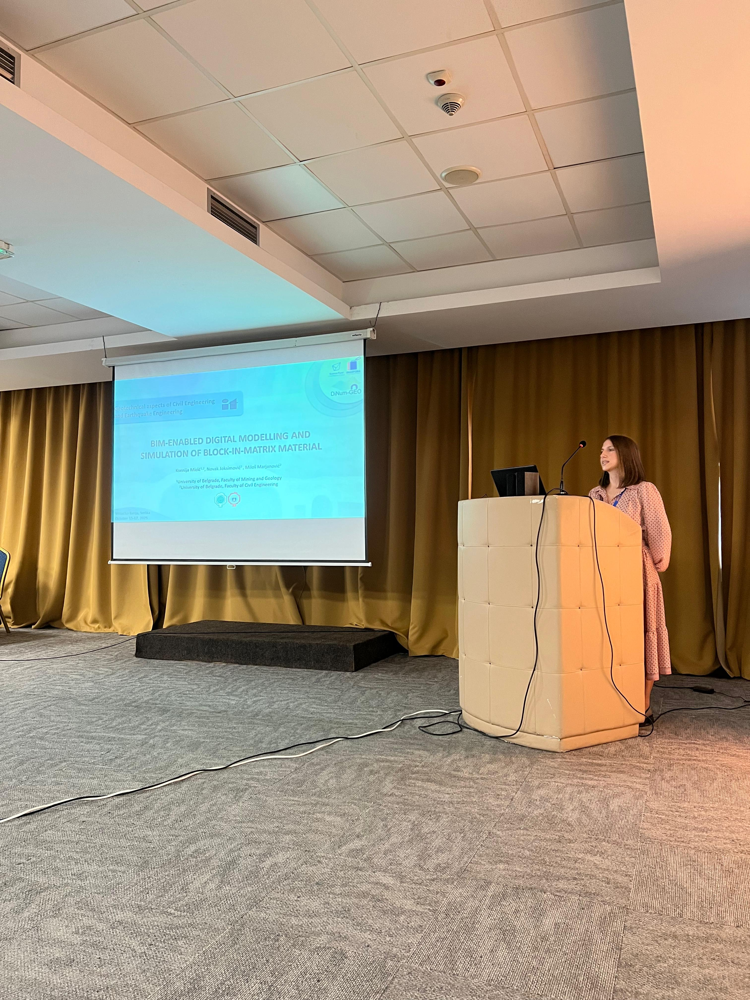

At the international scientific-professional conference “Geotechnical Aspects of Civil Engineering and Earthquake Engineering,” held from 15 to 17 October 2025, the DiNum team presented its scientific results from the project through the paper “BIM-enabled digital modelling and simulation of block-in-matrix material.” This paper attracted significant attention from the audience, along with substantial discussion and comments that will be implemented in improving the methodology and tools used. This conference was another great opportunity for networking with colleagues from academia and industry across Serbia and the region.
More about the publication at the link: ***************************************************.

  

    
    
  

  <button onclick="dinumgeoCarouselMove(-1)"
    style="position: absolute; left: 8px; top: 50%; transform: translateY(-50%); background: rgba(0,0,0,0.4); color: white; border: none; width: 40px; height: 40px; border-radius: 50%; cursor: pointer; font-size: 20px;">
    ‹
  </button>

  <button onclick="dinumgeoCarouselMove(1)"
    style="position: absolute; right: 8px; top: 50%; transform: translateY(-50%); background: rgba(0,0,0,0.4); color: white; border: none; width: 40px; height: 40px; border-radius: 50%; cursor: pointer; font-size: 20px;">
    ›
  </button>

