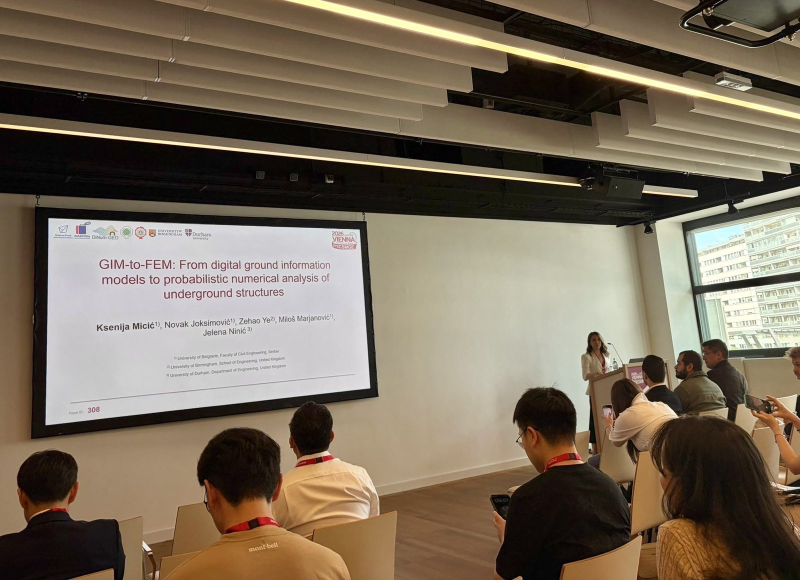
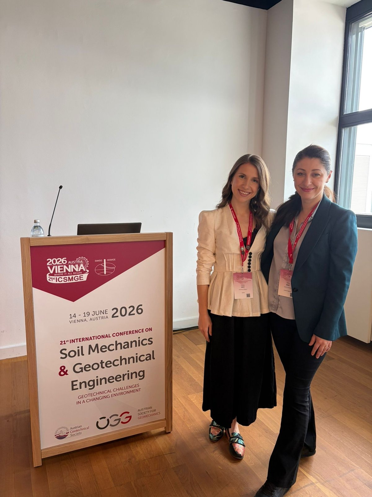

At the world conference "21st International Conference on Soil Mechanics and Geotechnical Engineering," held from 14 to 19 June 2026 in Vienna, Austria, the DiNum team presented its results through the paper "GIM-to-FEM: From Digital Ground Information Models to Probabilistic Numerical Analysis of Underground Structures," in collaboration with the University of Birmingham. Beyond the great company, meeting new colleagues and collaborators, and enjoying the lectures and the city, the DiNum team representatives also had the opportunity to exchange numerous experiences on complementary modelling topics, as well as to receive valuable suggestions and advice for further advancing the research and its application in practice.

More about the event at the link: [ICSMGE 2026](https://www.icsmge2026.org/en/).
More about the publication at the link: ***.

  

    
    
  

  <button onclick="dinumgeoCarouselMove(-1)"
    style="position: absolute; left: 8px; top: 50%; transform: translateY(-50%); background: rgba(0,0,0,0.4); color: white; border: none; width: 40px; height: 40px; border-radius: 50%; cursor: pointer; font-size: 20px;">
    ‹
  </button>

  <button onclick="dinumgeoCarouselMove(1)"
    style="position: absolute; right: 8px; top: 50%; transform: translateY(-50%); background: rgba(0,0,0,0.4); color: white; border: none; width: 40px; height: 40px; border-radius: 50%; cursor: pointer; font-size: 20px;">
    ›
  </button>

