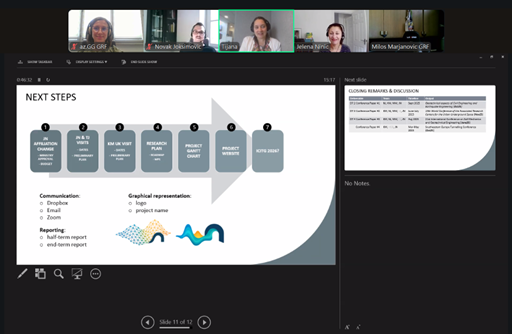

The kick-off meeting of the DiNum-GEO project was held on 16.10.2025 in an online format. The meeting was attended by all members of our multidisciplinary team. This online connection brought together representatives of leading global institutions in the fields of geotechnics, digital engineering, and geospatial data management – the Faculty of Civil Engineering, University of Belgrade, Durham University, and the British Geological Survey. The team from Serbia, together with diaspora partners Dr. Jelena Ninić and Dr. Tijana Jovanović, established a general action plan for the project activities and agreed on details related to the implementation of the research visits.

  

    
  

  <button onclick="dinumgeoCarouselMove(-1)"
    style="position: absolute; left: 8px; top: 50%; transform: translateY(-50%); background: rgba(0,0,0,0.4); color: white; border: none; width: 40px; height: 40px; border-radius: 50%; cursor: pointer; font-size: 20px;">
    ‹
  </button>

  <button onclick="dinumgeoCarouselMove(1)"
    style="position: absolute; right: 8px; top: 50%; transform: translateY(-50%); background: rgba(0,0,0,0.4); color: white; border: none; width: 40px; height: 40px; border-radius: 50%; cursor: pointer; font-size: 20px;">
    ›
  </button>

