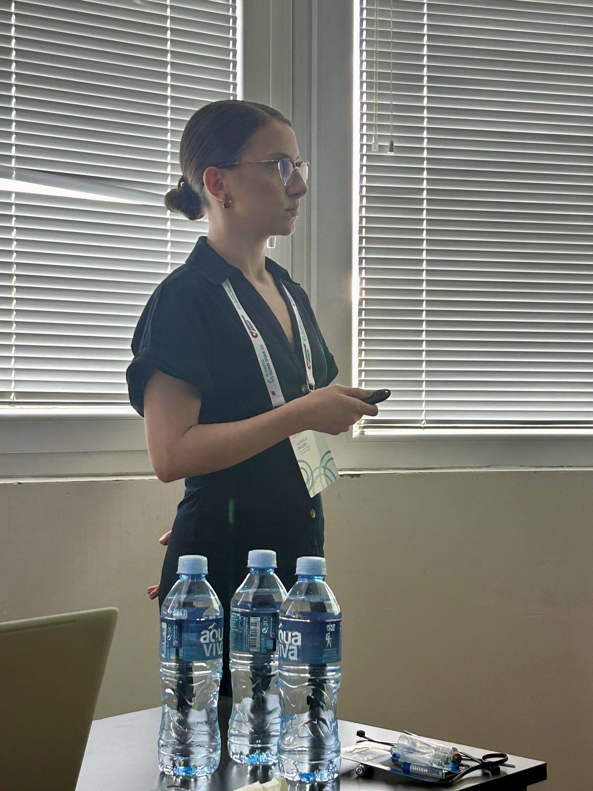
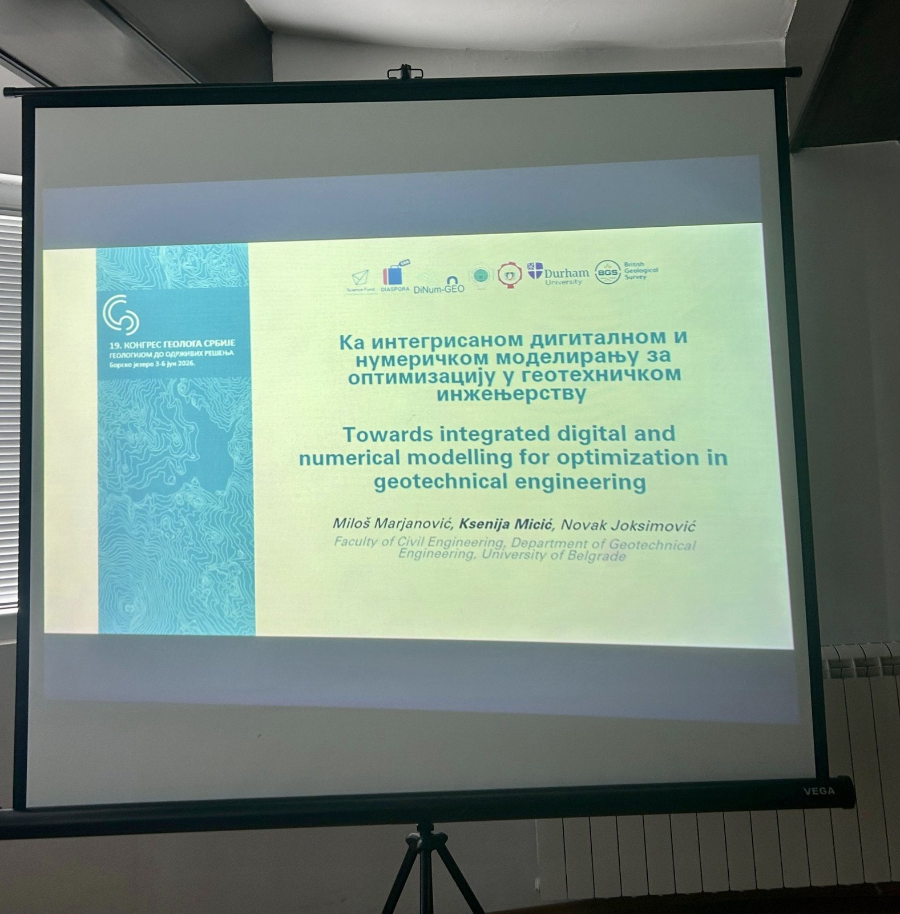

In line with the project's mission of promoting the inseparable connection between geological and geotechnical engineering, DiNum-GEO was also presented at the 19th Congress of Geologists of Serbia, held from 3 to 6 June at Borsko Lake. It was both a pleasure and a challenge to convey our project and its significance to fellow geologists in a concise form. Judging by their reactions, questions, and discussions, it seems we succeeded! When carrying out research, it is of great importance to hear the opinions of experts from complementary fields, to value them, and to apply them appropriately. The ideas and suggestions we brought back from the Congress will certainly find their place in the further stages of our research.

More about the event at the link: [Congress of Geologists of Serbia](https://19kongres.sgd.rs/).
More about the publication at the link: [Towards Integrated Digital and Numerical Modelling for Optimization in Geotechnical Engineering]().

  

    
    
  

  <button onclick="dinumgeoCarouselMove(-1)"
    style="position: absolute; left: 8px; top: 50%; transform: translateY(-50%); background: rgba(0,0,0,0.4); color: white; border: none; width: 40px; height: 40px; border-radius: 50%; cursor: pointer; font-size: 20px;">
    ‹
  </button>

  <button onclick="dinumgeoCarouselMove(1)"
    style="position: absolute; right: 8px; top: 50%; transform: translateY(-50%); background: rgba(0,0,0,0.4); color: white; border: none; width: 40px; height: 40px; border-radius: 50%; cursor: pointer; font-size: 20px;">
    ›
  </button>

