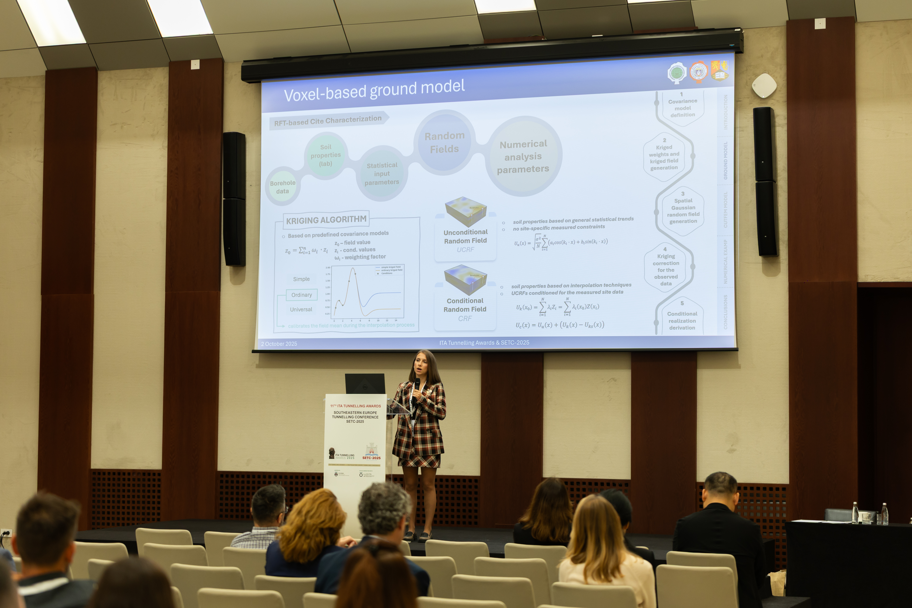

The first publication titled “Computer-aided ground modelling including soil spatial variability for geotechnical applications,” a result of dedicated and hard work on the project, was presented at the “Southeastern Europe Tunnelling Conference,” held from 1 to 3 October 2025 at the Sava Center in Belgrade. This event was an excellent opportunity to present original scientific research results to domestic and foreign audiences from leading global scientific institutions, as well as to numerous colleagues from industry. In addition to constructive discussions, comments, and the exchange of ideas, the DiNum team from Serbia used this conference to lay the groundwork for launching significant scientific collaborations with colleagues from industry.
More about the publication at the link: ***************************************************.

  

    
    
  

  <button onclick="dinumgeoCarouselMove(-1)"
    style="position: absolute; left: 8px; top: 50%; transform: translateY(-50%); background: rgba(0,0,0,0.4); color: white; border: none; width: 40px; height: 40px; border-radius: 50%; cursor: pointer; font-size: 20px;">
    ‹
  </button>

  <button onclick="dinumgeoCarouselMove(1)"
    style="position: absolute; right: 8px; top: 50%; transform: translateY(-50%); background: rgba(0,0,0,0.4); color: white; border: none; width: 40px; height: 40px; border-radius: 50%; cursor: pointer; font-size: 20px;">
    ›
  </button>

