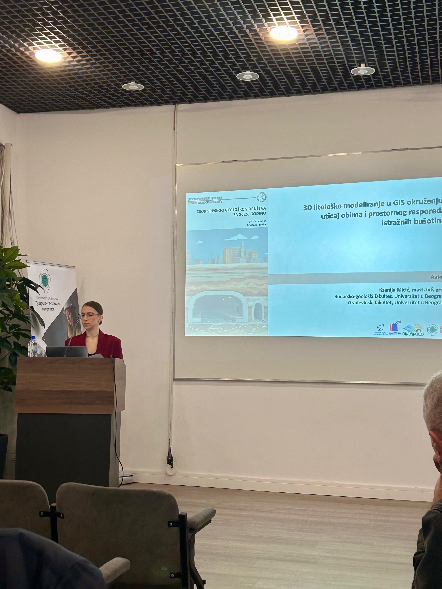

Considering that engineering-geological ground modelling plays a very important role in the DiNum-GEO concept and methodology, the project results were also presented to the geological audience at the Assembly of the Serbian Geological Society, held on 24.12.2025 at the premises of the Faculty of Mining and Geology. On this occasion, team member and doctoral student at the Department of Geotechnics of this faculty, Ksenija Micić, presented the paper “3D Voxel Lithological Modelling in a GIS Environment: The Influence of the Extent and Spatial Distribution of Exploratory Boreholes,” which was published in the nationally significant journal “Proceedings of the Serbian Geological Society.” In addition to establishing scientific cooperation with diaspora partners, strengthening cooperation with colleagues and experts from the University of Belgrade is also of great importance to the DiNum team, to which participation in this event significantly contributed. 
More about the event at the link: https://sgd.rs/odrzan-redovni-zbor-srpskog-geolosko/.
More about the publication at the link: *************************************************. 

  

    
  

  <button onclick="dinumgeoCarouselMove(-1)"
    style="position: absolute; left: 8px; top: 50%; transform: translateY(-50%); background: rgba(0,0,0,0.4); color: white; border: none; width: 40px; height: 40px; border-radius: 50%; cursor: pointer; font-size: 20px;">
    ‹
  </button>

  <button onclick="dinumgeoCarouselMove(1)"
    style="position: absolute; right: 8px; top: 50%; transform: translateY(-50%); background: rgba(0,0,0,0.4); color: white; border: none; width: 40px; height: 40px; border-radius: 50%; cursor: pointer; font-size: 20px;">
    ›
  </button>

